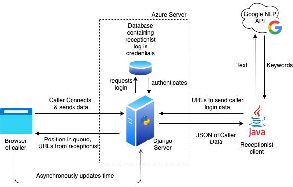

# Q-Vu, A Web Based Calling System

> *"A full webservice that enables any GP practice or NHS clinic with a laptop and a webcam to generate a virtualised call queue with real receptionists engaging from their practice or at home, like waiting to be seen in an actual practice. The service will be activated by a twillio SMS message while you are in a waiting call to activate a link. It will present a visualisation of the patient queue and an estimate as to how long the patient will wait to be seen, as well as the ability for patients to provide a quick summary of their query for receptionists to answer them faster. It may also provide possible FHIR interaction for simulating patient records access for even greater efficiency and patient attention."*

The three members of our team are; Shaheer Ahmed,  Joshua Mukherjee (https://docs.google.com/document/d/1vaBtuiiXsTMwcI_QWhE-9_imEbilTow2It6K-O0EpBU/edit), and Tangsheng Geng. We are second year students at UCL and this project was part of the COMP0016 module. 

Calling GPs can be a difficult process for both callers and GPs, callers don't know how long they will need to be waiting and receptionists can't see what anyone in the queue wants other than the person at the head. This project aims to solve this by creating a system to provide the callers with a better experience while also allowing receptionists to boost their efficiency.

Our solution to these problems is a web based app the callers can use to give their details and wait in a queue. The receptionists can see this queue and also the description of the problems that each caller has input. The callers can then be sent links to teams rooms to talk to a GP or self referral pages or various other resources as the receptionist seems fit. We chose to use a webapp as it doesn't require the caller to install anything new. Most people are familiar with websites and using a browser, making the system more accessible - something that we felt was important for an NHS calling system. The receptionist can have a java client as they will be using it on one or a few computers and so it can be installed on that computer. It also means the receptionist system is contained within NHS computers and not on an external server which is more complaint with the NHS security policy. The system is shown below:

The Google API is used to highlight keywords in the input the callers send the receptionist. In a sentence describing the problem a caller has the main entities in the sentence is identified and returned. These can then be presented in bold to the receptionist allowing them to more easily see what issues people have. The system also has the capability for a far greater degree of data collection compared to a standard system. The actions receptionists take, times of high load and various other data points can be captured and then analysed later by a the practice. Hopefully these additions will help the system to be more effective and help improve everyones experiences.

This work has potential to be used in many different industries, we have developed it for the NHS however any company who needs to have people call up would be able to apply this methodology. Some things may need to be changed, the exact details you collect, the pages the server can display to the user but the same structure of the project can be used.

In creating this project we have learnt a lot, none of us had used a web based system like this before or had any experience with Microsoft Azure. This project allowed us to investigate and solve problems ranging from technical to administrational for example how to coordinate a team while online and in very different timezones. Not all of these went smoothly from day one however over time we have developed into a team that can work well together and solve problems in, we hope, an effective manner. 

In the future this project can be taken and built on too. There is scope for a greater degree of data collection and analysis, the methods of interaction with the callers may need to be adapted depending on real world use, AI may be able to be employed to help suggest what actions can be taken (of course no decisions should be made solely by AI). The scope for this project's future is large and hopefully it can be taken forward to be used in a variety of industries and contexts and help many people reach who they need to. 

This is the link to out GitHub page: https://github.com/UCLComputerScience/COMP0016_Team34.github.io

