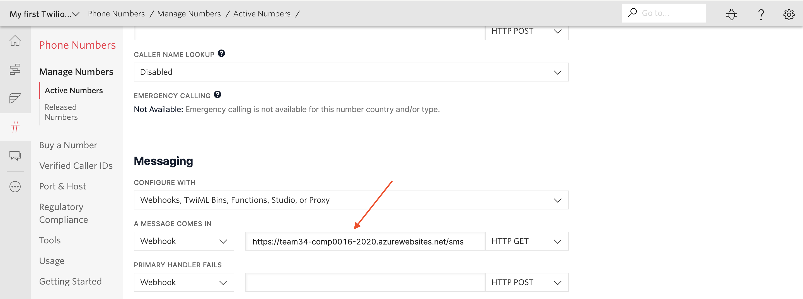
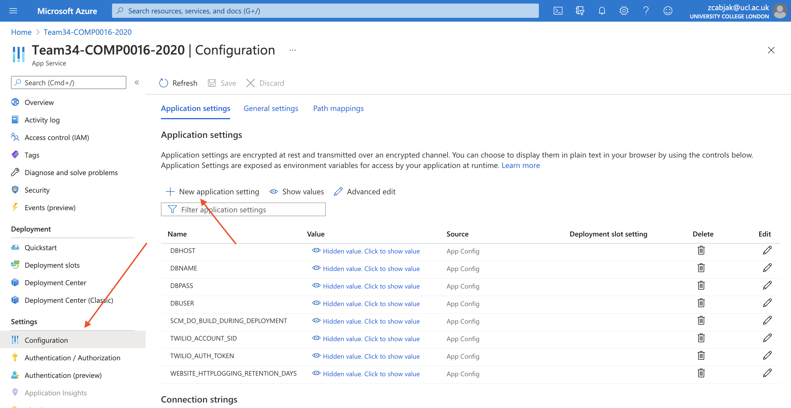
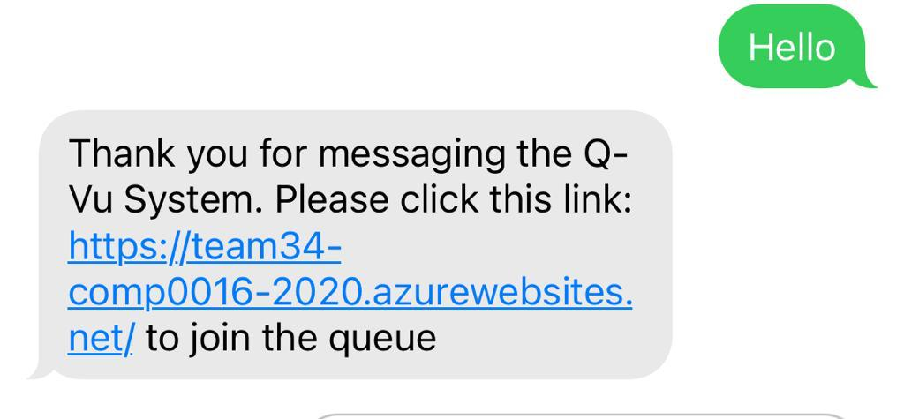

# Q-Vu
### Queue Management System

> *"A full web service that enables a GP or NHS clinic to host a virtual queue waiting system. This is activated by a Twilio SMS message and forwards you to a virtual queue. Receptionists can view everyone in the queue at once and see descriptions of the patients problems which have been given while they are waiting in the queue. The receptionist can then forward them on with links to resources or links to talk to other members of staff. The patient can see how many people are in the queue ahead of them hopefully reducing their frustration at having to wait."*

##### Receptionist Client

Before you start: 
The UI of this client is developed on a Windows machine, and is only guaranteed to work fine with windows.

To run the client, go inside the "application" folder, and double click on "launchClient(.vbs)".

To view the handling records, go inside the "application\classes" folder, and open "records.txt"
The records are in the following format:
time|caller's description|receptionist's name|the name of the link sent to the caller

The developer is not provided with a payed google account, and the developer is using his trial account to achieve
the google natural language processing service. This means this service shall expire in May. To continue using it,
follow the tutorial here: https://cloud.google.com/natural-language/docs/quickstarts 
Then replace the old json file with new credential json inside "application\classes\JsonCredential" folder.
Notice that the name of the json should still be "credential.json".

##### Azure server

Firstly install the azure CLI tools
On a mac:
```BASH
brew update && brew install azure-cli
```
On Linux:
```BASH
curl -sL https://aka.ms/InstallAzureCLIDeb | sudo bash
```
On Windows follow this url: https://docs.microsoft.com/en-us/cli/azure/install-azure-cli-windows?tabs=azure-cli

To deploy the Django code to an Azure Server

When in a directory containing the code to be deployed to the server (eg after it has been ```git pull```-ed from a repository). Firstly you will need to log in.
```BASH
az login
```
This will direct you to a login page - log in with your azure credentials. When you have logged in return to the terminal window


Set the subscription to be used
```BASH
az account set --subscription <sub>
```
Where
\<sub\> is the subscription id found in the azure portal


```BASH
az webapp up --resource-group <resource-group> --location <location> --name <app-name>
```
Where
\<resource-group\> is the name of the resource group to be used, if this does not exist it will be created
\<location\> The location of the server, eg uksouth
\<app-name\> The name of the app to be used. The server address will be https://\<app-name\>.azurewebsites.net

You can specify a sku and a plan using the --sku and --plan options however these are optional

After this has succeeded in future to redeploy to the server the command 

```BASH
az webapp up
```
can be run by itself. This will use the settings saved from the first call and will deploy to the server. 


###### Useful links
https://docs.microsoft.com/en-us/cli/azure/webapp?view=azure-cli-latest#az_webapp_up <br>
https://docs.microsoft.com/en-us/cli/azure/webapp/config?view=azure-cli-latest

##### Twilio

Twilio is used to manage the texting of patients when they want to join the queue. To set your own twilio key first you must make an account and get a number set up. Then go into the 'Active Numbers' tab scroll to the bottom and set the 'when a message comes in' url to be your azure url with /sms on the end



Then find your Account SID and Auth Token from twilio at the top of the dashboard in twilio. These need to be set as environment variables in django. This is different for running locally and on azure

###### Running Locally
Create a file Django/caller/secret.py containing the following:

```python
def setup():
    import os
    os.environ['TWILIO_ACCOUNT_SID'] = <ACCOUNT SID>
    os.environ['TWILIO_AUTH_TOKEN']  = <AUTH TOKEN>
```
Changing the account sid and auth token to be the ones from twilio. This file will be ignored by git therefore it will not be pushed to an external repository eg GitHub

###### Running on Azure
On the azure portal (https://azure.microsoft.com/en-gb/) navigate into the page for the Django server then click on configuration. Then click "New Application Setting" and enter "TWILIO_ACCOUNT_SID" as the name and the SID from twilio as the value. Repeat with "TWILIO_AUTH_TOKEN" and the auth token from twilio. 



When this is done the service should work as intended. To change the url of the queue being send change the value of ```URL``` in the ```sms``` function in ```views.py```



Q-Vu Queue Manager
Copyright (C) 2021 Joshua Mukherjee, Tansheng Geng, Shaheer Ahmed